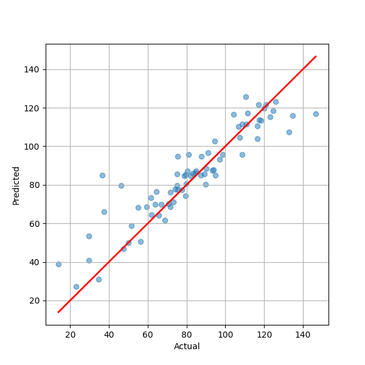
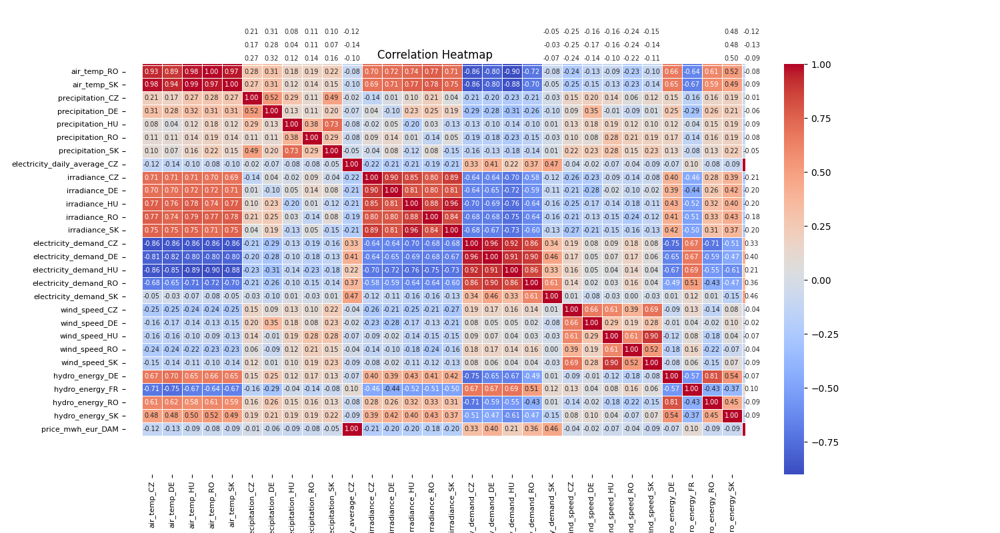

# CASSINI
CASSINI Hackthaton challange #2 - sustainable living.

## Goal
Predict electricity prices based on weather and other data from sattelites using machine learning AI model.

## Data sources

* Solar radiation
    * https://ads.atmosphere.copernicus.eu/cdsapp#!/dataset/cams-solar-radiation-timeseries?tab=form
    * Altitutde -999., universal time, 50.74424, 9.84271 - Germany, 49.94270, 15.11549 - Czechia
* Electricity price data
    * https://www.spotmarketindex.cz/
    * 1/1/2019-14/9/2024 daily averages
* Merged data
    * https://cds-beta.climate.copernicus.eu/datasets/sis-energy-derived-projections?tab=download

## Result with XG Boost Regressor

The final result with courated dataset using XG Boost Regressor model trained on local machine near realtime.

Mean Squared Error = 143.12066576374997
Mean Absolute Percentage Error =  14.69%
R-squared = 0.82

## VertexAI Google API
I also did experiment with Google VertexAI for training deep learning model in the cloud. It worked with smaller dataset and failed with larger with error:
"Too few rows were found when attempting to create time series. There must be at least 1000 rows, but only 367 with valid data were found." using Time series Dense Encoder (TiDE). With AutoML 

## Future research 
I would add sentiment analysis on the bloomberg or yahoo finance articles into the dataset to see if that can help with predicting prices. 

## Other models

* CatBoost Reggressor (iterations=15,depth=10,learning_rate=1,loss_function='RMSE')
    * Mean Squared Error = 199.24074443265312
    * Mean Absolute Percentage Error =  15.43%
    * R-squared = 0.75
* RandomForest
    * Mean Squared Error = 179.65316662499995
    * Mean Absolute Percentage Error =  17.56%
    * R-squared = 0.78
* Linear Regression
    * Mean Squared Error = 226.9524289249845
    * Mean Absolute Percentage Error =  19.21%
    * R-squared = 0.72
* XGBRegressor 
    * Mean Squared Error = 143.12066576374997
    * Mean Absolute Percentage Error =  14.69%
    * R-squared = 0.82

## The Journey & Observations
We can fairly accuretly predict electricity demand with the XGBoost Regressor - improved by scaler:
Mean Squared Error = 37873863.09106111
Mean Absolute Percentage Error =  0.16%
R-squared = 0.98

However it fails when trying to preditct the electricity prices taken from www.spotmarketindex.cz. Prices were taken outside the original dataset from spot market values. The Cassini dataset might be inaccurate or the spot prices rely on more variables then just the weather data - highly likely. When confiding the dataset to last year we get these results:

XGBoost Regressor
Mean Squared Error = 325364.434709683
Mean Absolute Percentage Error =  54.00%
R-squared = 0.45

That is not accepteble. However when trying with DAM - day ahead market price (https://peaksubstation.com/day-ahead-vs-real-time-energy-markets/) index prices repoted by https://www.ote-cr.cz/en/statistics/yearly-market-report?date=2024-01-01 it seems better:

Mean Squared Error = 4617.042284111203
Mean Absolute Percentage Error =  24.72%
R-squared = -0.04

We have also tried "Random forest" algorithm (Mean Absolute Percentage Error =  25.99%) instead of "XGBRegressor" (Mean Absolute Percentage Error =  25.07%) and Linear regression (Mean Absolute Percentage Error =  28.76%).

Still not good enough thought. Maybe we need to think more about the data.

From the variables correlation heatmap graph we can see some interesting relations. For example the electricity demand in Czech Republic has less impact then electricity demand in Deutschland and suprisingly in Slovakia as well. On the other hand we can see that wind speed, precipitation and on shore hydro energy power output is not much of a factor.

By dropping these variables we improve the result slightly:

Mean Squared Error = 433.7925148901215
Mean Absolute Percentage Error =  24.59%
R-squared = 0.46

By restricting the data range to 1 year only we also get slightly better result:

Mean Squared Error = 323.5808738722185
Mean Absolute Percentage Error =  21.38%
R-squared = 0.60

Finally we get back to our dataset and settled with the results:
Mean Squared Error = 344.9708446309555
Mean Absolute Percentage Error =  19.79%
R-squared = 0.58

Can be certainly improved. Let's add more data - including all the EU states:

with wind on shore power data:
[5 rows x 137 columns]
Mean Squared Error = 189.01761067004315
Mean Absolute Percentage Error =  16.87%
R-squared = 0.77

hydropower reservoir added:
[5 rows x 148 columns]
Mean Squared Error = 143.12066576374997
Mean Absolute Percentage Error =  14.69%
R-squared = 0.82

hydropower run of a river added:
[5 rows x 159 columns]
Mean Squared Error = 143.12012356454863
Mean Absolute Percentage Error =  15.09%
R-squared = 0.82

Here we are seeing diminishing returns when adding more data.

## Team
* Vojtech Leischner
    * PhD at CVUT FEL - computer graphics department
    * developer
    * computer vision, motion analysis, spatial audio, VR, AI
    * FAMU Audiovisual studies graduate
* Pavel Husa
    * PhD at CVUT FEL - computer graphics department
    * programmer
    * jazz musician, spatial audio, EEG
    * IT computer science graduate
* Vojtech Salek
    * 3D graphic designer, modeller and dataset preparation artist
    * UMPRUM graduate, ceramics and porcelain

## Related resources
* Forecasting day-ahead electricity prices: A comparison of time series and neural network models taking external regressors into account https://www.sciencedirect.com/science/article/abs/pii/S0140988321005879

"Regarding the overall forecasting results, one has to acknowledge that the neural network approaches outperformed the time series models in seven out of twelve prediction samples and the LSTM had the most satisfactory performance metrics on average. Nevertheless, while the LSTM showed the best forecasting results in the majority of prediction samples, the two-stage VAR turned out to provide the second-best EPF, surpassing the CNN-LSTM."

* https://www.sciencedirect.com/science/article/abs/pii/S037877962400018X

SARIMAX2021 mean error: 11.77
LSTM2021 mean error:  12.62
CNN-LSTMSep2021 mean error: 10.03

Considering these are deep learning models the value 15% mean error for "simple" XGBRegressor seems like a good result.